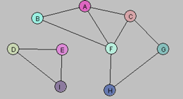

### What is the adjacency matrix of the graph G = (V,E) displayed below

|   | A | B | C | D | E | F | G | H | I |
|:--|:-:|--:|--:|--:|--:|--:|--:|--:|--:|
| A | 0 | 1 | 1 | 0 | 0 | 1 | 0 | 0 | 0 |
| B | 1 | O | 0 | 0 | 0 | 1 | 0 | 0 | 0 |
| C | 1 | O | 0 | 0 | 0 | 1 | 1 | 0 | 0 |
| D | 0 | O | 0 | 0 | 1 | 0 | 0 | 0 | 1 |
| E | 0 | O | 0 | 1 | 0 | 0 | 0 | 0 | 1 |
| F | 1 | 1 | 1 | 0 | 0 | 0 | 0 | 1 | 0 |
| G | 0 | 0 | 1 | 0 | 0 | 0 | 0 | 1 | 0 |
| H | 0 | 0 | 0 | 0 | 0 | 1 | 1 | 0 | 0 |
| I | 0 | 0 | 0 | 1 | 1 | 0 | 0 | 0 | 0 |

