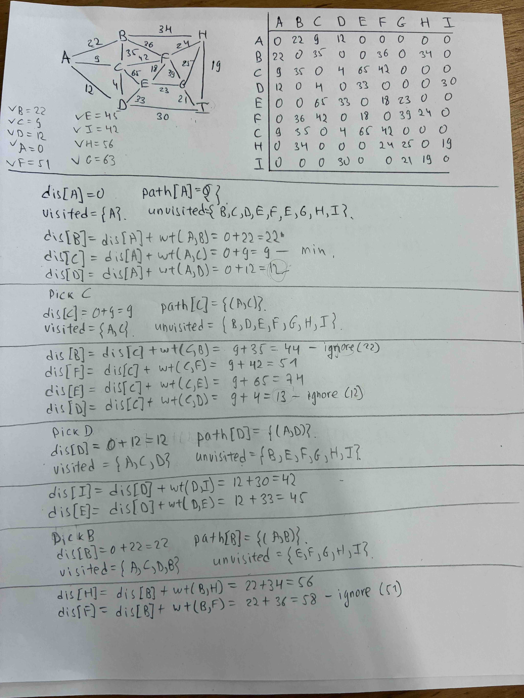
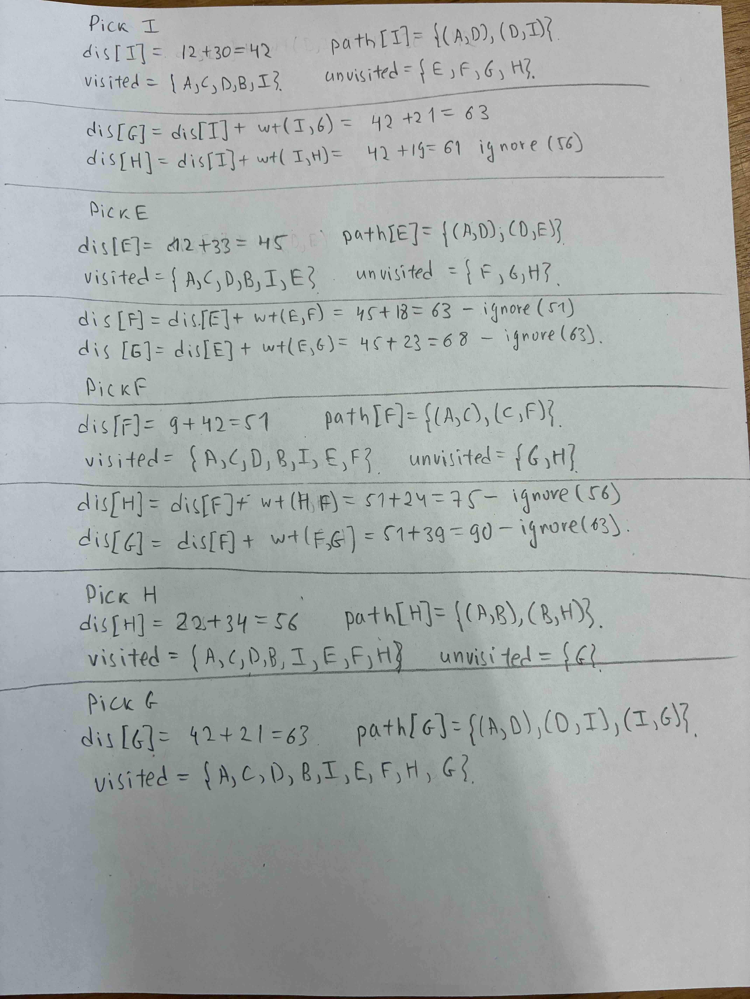
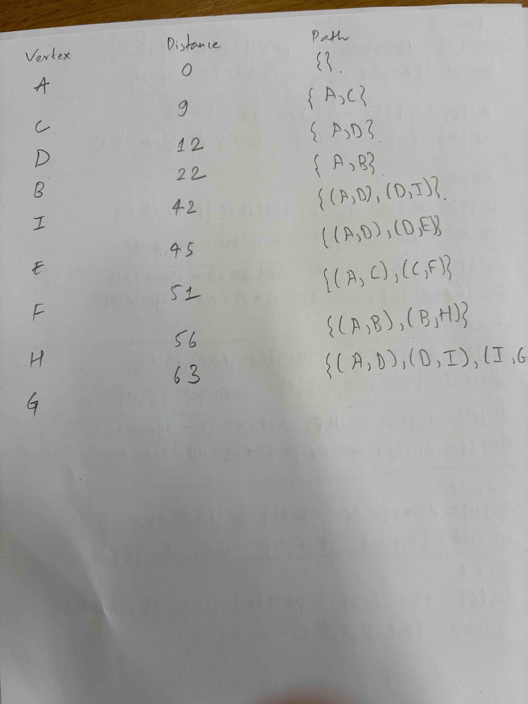
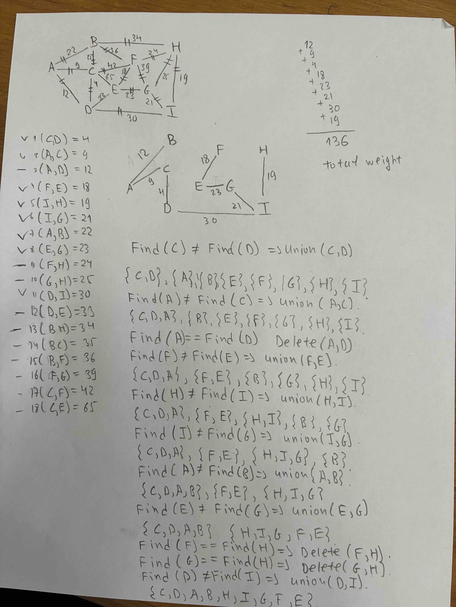
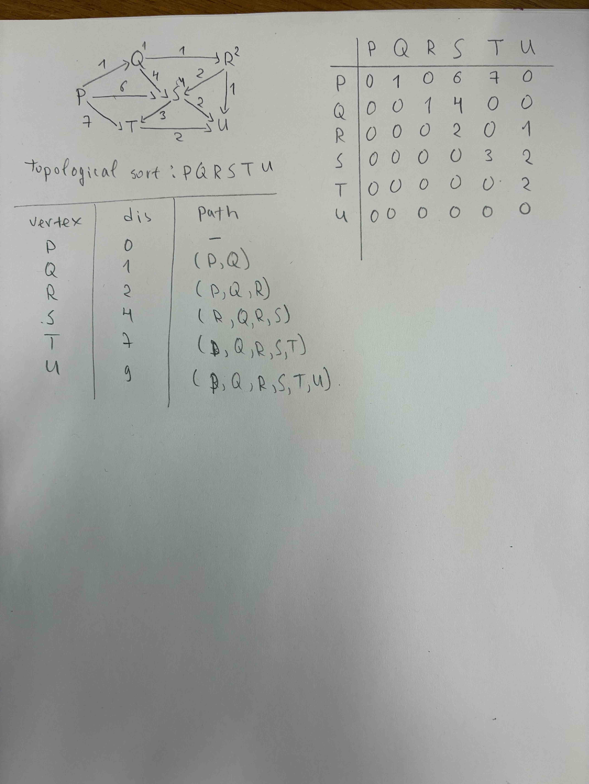

### 1. What is the adjacency matrix of the weighted graph G = (V,E) shown in Figure 1.
### 2. Find the shortest path from A to all other vertices using Dijkstra’s algorithm

### 3. The time complexity is O(m log n) = O(18 log 9)
### 4. Find a minimum spanning tree using Kruskal’s Algorithm

### 5. The time complexity is O(m log n) = O(8 log 9)

### 6.	What is the adjacency matrix of the weighted directed Acyclic graph G = (V,E) shown in Figure 2.
### 7.	Find the shortest path from P to U. (Figure 2). (Use the algorithm starting at slide 33).

### 8. The time complexity is O(m + n) = O(10 + 6)
### 9. Can you use Dijkstra’s algorithm (Slide 12) to find the shortest path from P to U? (Figure 2). - Yes, we can find the shortest path by using Dijkstra's algorithm
### 10.	If “Yes”, find the shortest path from P to U using Dijkstra’s algorithm (Slide 12) (Figure 2).
